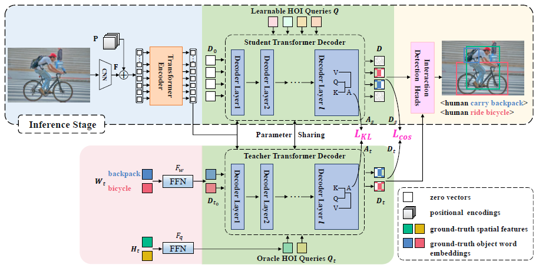

# Distillation Using Oracle Queries for Transformer-based Human-Object Interaction Detection
Xian Qu,
Changxing Ding,
Xingao Li,
Xubin Zhong,
Dacheng Tao

The [paper](https://openaccess.thecvf.com/content/CVPR2022/papers/Qu_Distillation_Using_Oracle_Queries_for_Transformer-Based_Human-Object_Interaction_Detection_CVPR_2022_paper.pdf) is accepted to CVPR2022.

<div align="center">
  
</div>

## Preparation

### Environment
Our implementation uses environment the same as [QPIC](https://github.com/hitachi-rd-cv/qpic),
please follow QPIC to set up pytorch environment.

### Dataset

The dataset structure is:
```
qpic
 |─ data
 |   └─ hico_20160224_det
 |       |─ annotations
 |       |   |─ trainval_hico.json
 |       |   |─ test_hico.json
 |       |   |─ sim_index_hico.pickle
 |       |   |─ coco_clipvec.npy
 |       |   └─ corre_hico.npy
 |       |─ images
 |       |   |─ test2015
 |       |   └─ train2015
 
 |   └─ v-coco
 |       |─ annotations
 |       |   |─ trainval_vcoco.json
 |       |   |─ test_vcoco.json
 |       |   |─ corre_vcoco.npy
 |       |   |─ vcoco_test.json
 |       |   |─ instances_vcoco_all_2014.json
 |       |   |─ sim_index_vcoco.pickle
 |       |   |─ vcoco_clip.npy
 |       |   └─ vcoco_test.ids
 |       |─ images
 |       |   |─ train2014
 |       |   └─ val2014
 
 |   └─ hoia
 |       |─ annotations
 |       |   |─ test_2019.json
 |       |   |─ train_2019.json
 |       |   |─ obj_clipvec.npy
 |       |   |─ sim_index_hoia.pickle
 |       |   └─ corre_hoia.npy
 |       |─ images
 |       |   |─ test
 |       |   └─ trainval
```

The annotations file,
pre-trained weights and 
trained parameters can be downloaded [here](https://drive.google.com/drive/folders/1dVaHxMbSIwStARIMH_kDbosA5ZDi84Rj?usp=sharing)

Please download the images at the official website for the datasets above.

## Training
After the preparation, you can start the training with the following command.

For the HICO-DET training.
```
python -m torch.distributed.launch \
--nproc_per_node=8 \
--use_env \
main.py \
--pretrained params/detr-r50-pre.pth \
--hoi \
--dataset_file hico \
--hoi_path data/hico_20160224_det \
--num_obj_classes 80 \
--num_verb_classes 117 \
--backbone resnet50 \
--set_cost_bbox 2.5 \
--set_cost_giou 1 \
--bbox_loss_coef 2.5 \
--giou_loss_coef 1 \
--output_dir outputs/hico/ts_model/ \
--model_name hoi_ts 
```

For the V-COCO training.
```
python -m torch.distributed.launch \
--nproc_per_node=8 \
--use_env \
main.py \
--pretrained params/detr-r50-pre-vcoco.pth \
--hoi \
--dataset_file vcoco \
--hoi_path data/v-coco \
--num_obj_classes 81 \
--num_verb_classes 29 \
--backbone resnet50 \
--set_cost_bbox 2.5 \
--set_cost_giou 1 \
--bbox_loss_coef 2.5 \
--giou_loss_coef 1 \
--output_dir outputs/vcoco/ts_model/ \
--model_name hoi_ts 
```

For the HOI-A training.
```
python -m torch.distributed.launch \
--nproc_per_node=8 \
--use_env \
main.py \
--pretrained params/detr-r50-pre-hoia.pth \
--hoi \
--dataset_file hoia \
--hoi_path data/hoia/ \
--num_obj_classes 11 \
--num_verb_classes 10 \
--backbone resnet50 \
--set_cost_bbox 2.5 \
--set_cost_giou 1 \
--bbox_loss_coef 2.5 \
--giou_loss_coef 1 \
--output_dir outputs/hoia/ts_model/ \
--model_name hoi_ts 
```

## Evaluation
The evaluation is conducted at the end of each epoch during the training. The results are written in `outputs/log.txt` like below:

You can also conduct the evaluation with trained parameters as follows.

HICO-DET
```
python -m torch.distributed.launch \
--nproc_per_node=8 \
--use_env \
main.py \
--pretrained params/detr-r50-pre.pth \
--hoi \
--dataset_file hico \
--hoi_path data/hico_20160224_det \
--num_obj_classes 80 \
--num_verb_classes 117 \
--backbone resnet50 \
--set_cost_bbox 2.5 \
--set_cost_giou 1 \
--bbox_loss_coef 2.5 \
--giou_loss_coef 1 \
--output_dir outputs/hico/ts_model/ \
--model_name hoi_ts \
--resume outputs/hico/ts_model/checkpoint.pth \
--eval \
--no_aux_loss
```

HOI-A
```
python -m torch.distributed.launch \
--nproc_per_node=8 \
--use_env \
main.py \
--pretrained params/detr-r50-pre-hoia.pth \
--hoi \
--dataset_file hoia \
--hoi_path data/hoia/ \
--num_obj_classes 11 \
--num_verb_classes 10 \
--backbone resnet50 \
--set_cost_bbox 2.5 \
--set_cost_giou 1 \
--bbox_loss_coef 2.5 \
--giou_loss_coef 1 \
--output_dir outputs/hoia/ts_model/ \
--model_name hoi_ts \
--resume outputs/hoia/ts_model/checkpoint.pth \
--eval \
--no_aux_loss
```


For the official evaluation of V-COCO, a pickle file of detection results have to be generated. You can generate the file as follows.
```
python generate_vcoco_official.py \
--param_path outputs/vcoco/ts_model/checkpoint.pth \
--save_path vcoco.pickle \
--hoi_path data/v-coco \
--model_name hoi_ts_qpos_eobj_kl
```


## Results
HICO-DET.
|| Full (D) | Rare (D) | Non-rare (D) | Full(KO) | Rare (KO) | Non-rare (KO) |
| :--- | :---: | :---: | :---: | :---: | :---: | :---: |
|ours (HOTR)| 25.97 | 26.09 | 25.93 | 28.23 | 28.22 | 33.93 |
|ours (QPIC)| 31.55 | 26.75 | 32.99 | 34.15 | 29.62 | 35.50 |
|ours (CDN-S)| 33.28 | 29.19 | 34.50 | 36.11 | 31.61 | 37.45 |

D: Default, KO: Known object

V-COCO.
|| Scenario 1 | 
| :--- | :---: |
|ours (ResNet50)| 63.5 |


HOI-A.
|| mAP | 
| :--- | :---: |
|ours (ResNet50)| 76.87 |

## Citation
Please consider citing our paper if it helps your research.
```
@InProceedings{Qu_2022_CVPR,
    author    = {Qu, Xian and Ding, Changxing and Li, Xingao and Zhong, Xubin and Tao, Dacheng},
    title     = {Distillation Using Oracle Queries for Transformer-Based Human-Object Interaction Detection},
    booktitle = {Proceedings of the IEEE/CVF Conference on Computer Vision and Pattern Recognition (CVPR)},
    month     = {June},
    year      = {2022},
    pages     = {19558-19567}
}
```

## Acknowledgement
[QPIC](https://github.com/hitachi-rd-cv/qpic)
